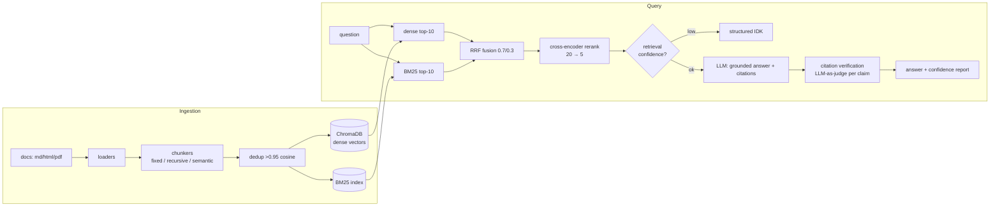

# RAG Pipeline with Hybrid Search

A production-grade Retrieval-Augmented Generation system over technical documentation:
**dense vector search + BM25 keyword search fused with Reciprocal Rank Fusion, cross-encoder
reranking, grounded answers with per-claim citation verification, and a 50+ question
evaluation suite** that measures every architectural decision in this repo.

## Results

> Fill this table by running `uv run python scripts/run_eval.py --mode hybrid` and
> `--mode dense` (each run prints and saves a markdown report under `data/eval_runs/`).
> On a local 7B model a full run takes a while — start it and walk away.

| Metric | Hybrid + rerank | Dense-only |
|---|---|---|
| Answer correctness | TBD | TBD |
| Faithfulness | TBD | TBD |
| Retrieval hit@5 | TBD | TBD |
| Citation accuracy | TBD | TBD |

Chunking strategy comparison (fixed vs recursive vs semantic):
`uv run python scripts/run_eval.py --compare-strategies` → `data/eval_runs/comparison_<date>.md`

Everything above reproduces on a laptop with no API keys and no paid services.

## Why this isn't a LangChain quickstart

- **Hybrid retrieval, hand-built.** BM25 catches the exact identifiers
  (`response_model_exclude_none`, error codes, config keys) that embeddings blur;
  RRF fusion and the rerank stage are implemented from the papers, not imported.
- **Citations are verified, not just requested.** Every claim/citation pair goes through
  an LLM-as-judge check; unsupported citations are flagged in the response (and shown
  red in the dashboard).
- **Honest "I don't know."** Below a retrieval-confidence threshold the system returns a
  structured not-found response instead of hallucinating — and skips the LLM call entirely.
- **Decisions are measured.** Three chunking strategies indexed side by side and compared
  on the same golden set. See [DECISIONS.md](DECISIONS.md).
- **Provider-agnostic by design.** Runs 100% free/local (Ollama + sentence-transformers);
  the deployed instance swaps to a hosted 70B LLM (Groq free tier) with only env-var changes.

## Architecture



## Quickstart

Local, fully free (needs [uv](https://docs.astral.sh/uv/), [Ollama](https://ollama.com)
with `qwen2.5:7b` pulled, and Node for the dashboard):

```bash
git clone <repo> && cd rag-pipeline
cp .env.example .env                      # defaults already point at local Ollama
uv sync
uv run python scripts/fetch_corpus.py     # downloads the doc corpus (~244 files)
uv run python scripts/ingest.py           # chunk + embed + index (all 3 strategies)

# ask from the terminal:
uv run python scripts/ask.py "How do I declare a request body in FastAPI?"

# or run the full service + dashboard:
uv run uvicorn rag.api.main:app --reload  # API on :8000 (docs at /docs)
cd frontend && npm install && npm run dev # dashboard on :5173

# or the whole thing in one container:
docker compose up --build                 # -> http://localhost:8000 (API + built dashboard)
```

Useful CLIs:

```bash
uv run python scripts/compare_retrieval.py "response_model_exclude_none"   # dense vs sparse vs hybrid, side by side
uv run python scripts/run_eval.py --limit 5                                # smoke-test the eval loop
uv run pytest                                                              # unit tests (no LLM needed)
```

## Stack

Python 3.12 · uv · sentence-transformers (BGE-small) · ChromaDB · rank-bm25 ·
cross-encoder reranker · Ollama (local) / Groq (deployed) via one OpenAI-compatible client ·
FastAPI · React + Vite · Docker · Railway

## Repo tour

| Path | What |
|---|---|
| `src/rag/ingest/` | loaders, 3 chunking strategies, near-dup detection |
| `src/rag/index/` | Chroma + BM25 wrappers (one collection per chunking strategy) |
| `src/rag/retrieve/` | dense, sparse, RRF fusion, cross-encoder rerank, pipeline facade |
| `src/rag/generate/` | grounded prompting, ask() orchestrator, citation verification, confidence |
| `src/rag/evals/` | golden-set runner (cache-first), metrics, strategy-comparison reports |
| `src/rag/api/` | FastAPI service (serves the built React dashboard in prod) |
| `frontend/` | React dashboard: citations, chunk inspector, confidence, mode toggle |
| `data/golden/` | hand-written 53-question eval set (committed) |
| `DECISIONS.md` | why every tunable has the value it has |
